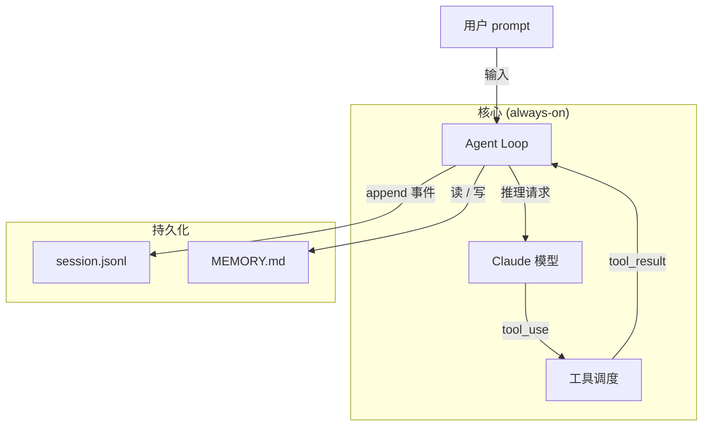

# 好范例：分层架构图（9 节点，subgraph + 标签边）

下图回答：「CC 一次请求经过哪几层？」

**为什么算好图**：

- 9 个节点，well below ≤12 上限
- `subgraph` 把"核心"和"持久化"分开，一眼看出层次
- 每条边都带动词（"输入" / "推理请求" / "tool_use" 等），不是裸箭头
- 方向 `TD` 自顶向下，符合数据流方向
- 节点标签用人话，ID 是 snake_case
- 没有混用 ASCII 或其他装饰
