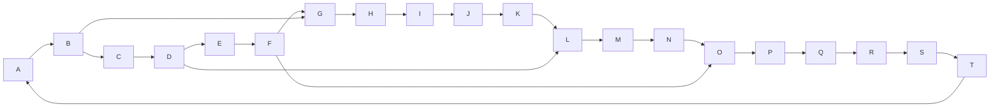

# 反范例：节点过多 + 边无标签

下图想表达「整个分布式订单系统的全景」——结果谁也看不懂：

**为什么算坏图**：

- 20+ 节点，远超 ≤12 上限
- 全是单字母 ID，没有显示标签，读者根本不知道每个圆圈是什么
- 所有边都是裸箭头，看不出每条边的语义（读还是写？同步还是异步？）
- 横向交叉箭头多，视觉上一片乱
- 图前钩子说"整个系统的全景"——这种意图本身就是危险信号，"全景图"几乎一定要被拆

**应该这样拆**：

按业务子域拆成 3 张图，每张 ≤7 节点：

- 图 1：下单链路（用户 → 购物车 → 库存 → 订单服务）
- 图 2：支付链路（订单 → 支付网关 → 银行 → 回调处理器）
- 图 3：履约链路（订单 → 仓库 → 物流 → 通知服务）

每张图自带"这张图回答什么问题"的钩子，再用一段文字把三张图串起来（"下单成功后会触发支付链路；支付成功的回调触发履约链路"）。
