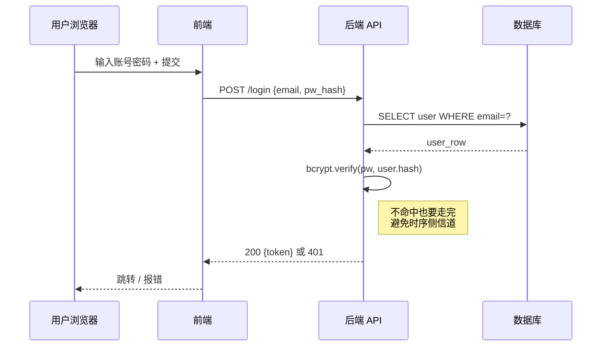

# 好范例：API 调用时序图

下图回答：「用户登录的请求-响应一来一回经过哪几方？」

**为什么算好图**：

- 4 个 participant，简洁
- 每条消息都带具体内容（请求路径 + payload 形状 / 返回字段），不是裸 `->>`
- 用 `Note` 标了一个关键设计点（恒定时间执行 bcrypt 防侧信道）——这种"读者最可能问'为什么'的地方"应该加 Note 而不是塞进正文长段落
- `API->>API` self-arrow 表达"内部计算"步骤，没有为此引入虚假的 `BcryptService` participant
- 错误路径（401）在同一条消息上用 "200 ... 或 401" 简写，避免画两条平行链
