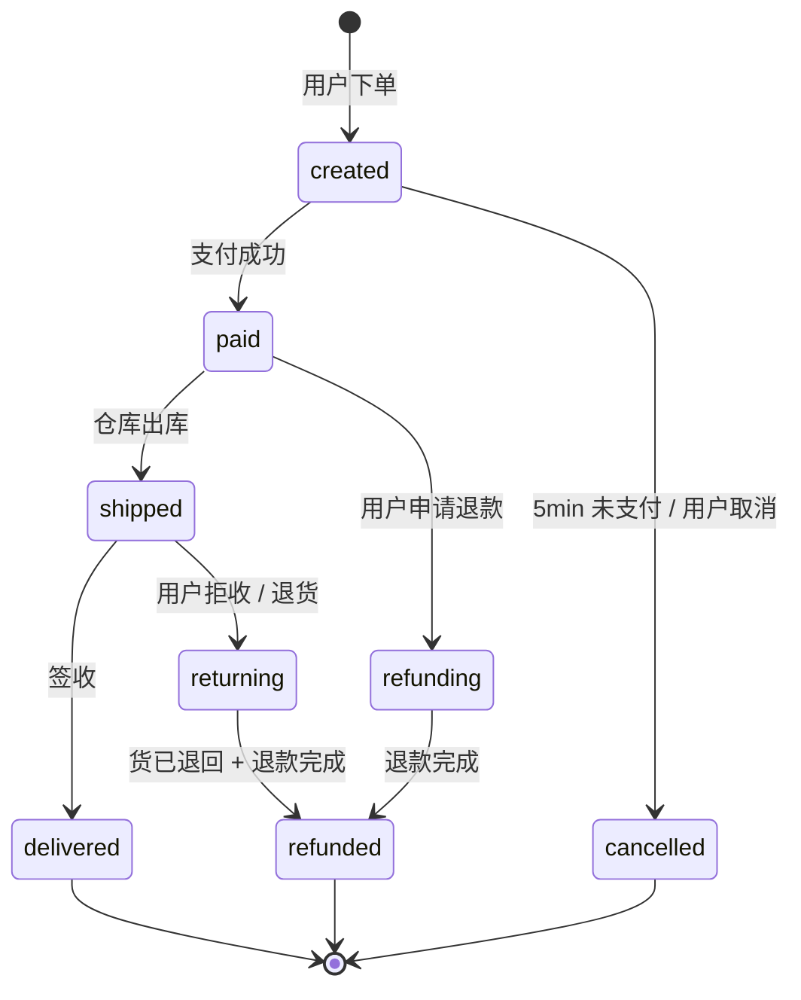

# 好范例：订单状态机

下图回答：「一个订单在系统里有哪几种状态，相互怎么跳转？」

**为什么算好图**：

- 7 个有效状态（不含 `[*]` 起点 / 终点），低于 12 上限
- 每条迁移边都标了**触发条件**（"用户下单" / "5min 未支付"），不是裸箭头
- `[*]` 起点终点清楚标出了"订单生命周期"的边界
- 退款汇聚到 `refunded` 后再到 `[*]`，把两条退款路径合流，比画两套独立终态更清晰

**读图要点**：

- 注意 `paid` 是关键分叉点——往下是正常履约，往左是退款链路
- `cancelled` 只能从 `created` 出去；已支付的订单**不能直接取消**（要走退款链路）——这个业务约束在图里通过"没有 paid → cancelled 的边"表达，比写"已支付订单不能取消"一句话更难被读者忽略
- `refunded` 是两条退款路径的汇合点，意味着任何下游处理（发短信通知 / 入账）只需要监听这一个状态，而不用同时盯 `refunding` 和 `returning`
